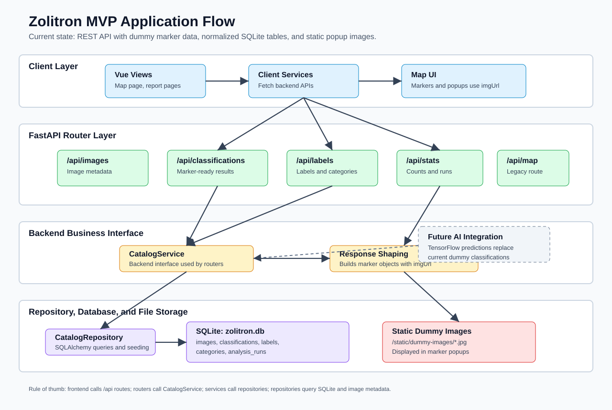

# Zolitron

Zolitron is an MVP web application for detecting and reviewing illegal garbage sites and vegetation/weeds from image data.

Users select a German city or area, the system retrieves or imports image data, classifies images, and visualizes detections on a map for review.

## Tech Stack

- Frontend: Vue 3, Vite, Vuetify, Vue Router, MapLibre GL
- Backend: Python, FastAPI, SQLAlchemy, Pydantic
- Storage: SQLite for metadata and local disk for image files
- AI/ML: Roboflow workflow inference through `inference-sdk`; TensorFlow and Pillow remain available for other image-classification work

## Prerequisites

Install these before cloning/running the project:

- [Node.js](https://nodejs.org/)
- [Python 3.11 or 3.12](https://www.python.org/downloads/) (`inference-sdk==0.20.0` is not supported by the project's current setup on Python 3.13)

Verify them from a terminal:

```bash
node --version
npm --version
python --version
```

On Windows, the scripts use the Python launcher:

```bash
py -3 --version
```

## Environment Variables

To use the map, create a `.env` file in the `client` directory:

```bash
client/.env
```

Add your MapTiler key:

```env
VITE_MAPTILER_KEY=YOUR_KEY
```

You can get a key from the MapTiler account page: https://cloud.maptiler.com/account/keys

To use the trash-detection model locally, create `backend/.env` and add:

```env
ROBOFLOW_API_KEY=YOUR_PRIVATE_API_KEY
ROBOFLOW_WORKSPACE=yoav1s-workspace
ROBOFLOW_WORKFLOW_ID=trash-vtrash-t8mku-2-rfdetr-large-t1-logic-2
ROBOFLOW_API_URL=https://serverless.roboflow.com
```

Never commit the API key. The workspace, workflow ID, and API URL have application defaults, but keeping them in the environment makes the model replaceable without changing backend code.

## Model Integration Status

The model connection was changed from the `roboflow` Python module to the `inference-sdk` module because the configured model is a Roboflow Workflow, not a standard Roboflow project-version prediction endpoint. The active backend integration now lives in `backend/app/services/detection.py` and calls `InferenceHTTPClient.run_workflow(...)`. The former `Roboflow(...).workspace(...).project(...).predict(...)` implementation treated the workflow ID as a project ID and therefore caused connection and lookup errors. Roboflow remains the external model platform; only the Python client module used to reach its serverless workflow has changed.

The current request path is:

```text
POST /api/detections/classify
  -> detection router
  -> DetectionService
  -> InferenceHTTPClient.run_workflow(...)
  -> Roboflow serverless workflow
  -> confidence filtering and API response mapping
```

Request example:

```json
{
  "image_url": "https://example.com/street-image.jpg",
  "city": "Bochum",
  "country": "Germany"
}
```

The response contains accepted predictions, bounding-box coordinates, `garbage_count`, `litter_count`, and `total_detections`. The service currently applies these per-class confidence thresholds:

- `garbage`: `0.65`
- `litter`: `0.60`

Implemented and reachable now:

- the `/api/detections/classify` route is registered in FastAPI and appears in `/docs`
- the router, schemas, and service import chain is connected
- the workflow receives the configured workspace, workflow ID, API URL, and image input
- workflow list output is unwrapped and mapped into the API response
- failed workflow calls are retried up to three times with exponential backoff
- missing credentials or a missing SDK return a controlled service-unavailable response instead of preventing backend startup
- Render and GitHub Actions are configured for Python 3.11, which is compatible with the pinned inference SDK

Current limitations and next steps:

1. Run a manual end-to-end request using an authorized `ROBOFLOW_API_KEY` and a representative local image and HTTPS image URL.
2. Confirm the live workflow output still uses `predictions.predictions` and the expected `garbage` and `litter` class names. Adjust the response adapter if the workflow schema differs.
3. Validate confidence thresholds against representative images and record the chosen values as model configuration rather than permanent code constants.
4. Add URL/file validation, request timeouts, maximum image-size handling, and safe restrictions for remotely fetched images.
5. Persist the raw model label, confidence, processing status, model/workflow version, and image relationship through the service/repository layers.
6. Connect successful detections to the map classification response and marker flow.
7. Add low-confidence review handling and the planned statuses: `pending`, `classified`, `low-confidence`, and `reviewed`.
8. Add batch processing with a configurable batch size and failure handling after single-image inference is verified.
9. Add detection service/router tests later; model-specific tests are intentionally deferred at the current stage.
10. Add monitoring that records request duration and failures without logging API keys or private image data.

Do not use `backend/app/services/trash_model_connection/trash_detection.py` as the application integration. It is a standalone/legacy script; production backend calls should go through `DetectionService`.

## Setup From A Fresh Clone

Run commands from the repository root.

### Windows

```bash
npm install
npm run install:all:win
npm run dev
```

### Linux / macOS

```bash
npm install
npm run install:all:linux
npm run dev:linux
```

The local URLs are:

- Client: http://localhost:5173/
- Backend: http://127.0.0.1:8000
- FastAPI docs: http://127.0.0.1:8000/docs

## Useful Commands

Run both frontend and backend:

```bash
npm run dev
```

Run frontend only:

```bash
npm run client
```

Run backend only on Windows:

```bash
npm run backend
```

Run backend only on Linux/macOS:

```bash
npm run backend:linux
```

## Testing

Run tests from the repository root after completing the setup for your OS.

## CI/CD and Deployment

This repository includes a basic CI/CD setup for GitHub Actions and deployment configuration for Render using PostgreSQL. It is not currently deployed: activation is waiting for access to the GitHub private-repository controls and secrets required to configure the workflow and Render deploy hook.

### CI workflow

The workflow in [.github/workflows/ci-cd.yml](.github/workflows/ci-cd.yml) will:

- install frontend dependencies
- run frontend tests and build
- install backend dependencies
- run backend tests and a syntax check
- deploy to Render automatically after a successful push to the main branch when a Render deploy hook is configured

Until the required GitHub access is available, the workflow and deployment files should be treated as prepared configuration, not as evidence of an active deployment. Once access is granted, configure the repository secrets, run the workflow without deployment first, verify all build steps, and only then enable the Render deploy hook.

### Render deployment

The deployment configuration is in [render.yaml](render.yaml). It defines:

- a backend web service for FastAPI
- a frontend static site for the Vue app
- a PostgreSQL database resource

For the full deployment checklist, team-only environment values, and secrets, see [usage.md](usage.md).

### Frontend Tests

```bash
npm run test:client
```

This runs the Vitest suite in `client/src/tests`.

### Backend Tests

Windows:

```bash
npm run test:backend
```

Linux/macOS:

```bash
npm run test:backend:linux
```

The backend test scripts use the project virtual environment at `backend/venv`. If the backend venv or dependencies are missing, run the setup command first:

```bash
npm run install:all:win
```

or on Linux/macOS:

```bash
npm run install:all:linux
```

You can also run pytest directly from the backend directory.

Windows:

```bash
cd backend
.\venv\Scripts\python -m pytest app/tests
```

Linux/macOS:

```bash
cd backend
./venv/bin/python -m pytest app/tests
```

Expected backend result for the current suite:

```text
8 passed
```

The backend tests may create a local `backend/zolitron.db` SQLite file. This file is ignored by Git and should not be committed.

## Frontend API Interfaces

Use the backend base URL from the client environment variable when adding frontend service functions:

```env
VITE_API_BASE_URL=http://127.0.0.1:8000
```

If `VITE_API_BASE_URL` is not set, frontend services should default to the local backend URL during development.

### Marker / Classification Data

```text
GET /api/classifications
```

Optional query parameters:

```text
city=Bochum
label=garbage
```

Examples:

```text
GET /api/classifications?city=Bochum
GET /api/classifications?label=garbage
GET /api/classifications?city=Bochum&label=garbage
```

Response shape:

```json
[
  {
    "id": 1,
    "image_id": 1,
    "label_id": 1,
    "category_id": 1,
    "analysis_run_id": 1,
    "label": "overgrown",
    "category": "vegetation",
    "confidence": 0.91,
    "status": "classified",
    "latitude": 51.4818,
    "longitude": 7.2162,
    "imgUrl": "/static/dummy-images/overgrown-1.jpg",
    "city": "Bochum",
    "country": "Germany"
  }
]
```

Use this endpoint for map markers and marker popups. The `label` field is intended for marker color decisions. The `imgUrl` field points to an image that can be displayed in the popup.

### Images

```text
GET /api/images
GET /api/images/{image_id}
```

Returns image metadata and image URLs. Use this when a frontend view needs image records without classification details.

### Labels And Categories

```text
GET /api/labels
GET /api/labels/categories
```

Use these endpoints if the frontend needs to build filters, legends, or label/category descriptions.

Current labels:

```text
overgrown
not-overgrown
garbage
not-garbage
```

Current categories:

```text
vegetation
waste
```

### Statistics

```text
GET /api/stats
GET /api/stats/analysis-runs
```

Use these endpoints for dashboards, counters, or backend status summaries.

### Legacy Map Endpoint

```text
POST /api/map/dump-data
```

Request body:

```json
{
  "city": "Bochum",
  "country": "Germany"
}
```

This currently returns the same marker-ready classification shape as `/api/classifications`, filtered by city. New frontend work should prefer `GET /api/classifications` unless it specifically needs to preserve the older map service behavior.

### Static Popup Images

```text
GET /static/dummy-images/{filename}
```

Example:

```text
GET /static/dummy-images/overgrown-1.jpg
```

These files are referenced by `imgUrl` in classification/image responses.

### API Errors

All API errors should use this shape:

```json
{
  "detail": "Image not found.",
  "code": "IMAGE_NOT_FOUND"
}
```

Frontend code should display `detail` to users when appropriate and may use `code` for branching or tests.

## Backend Data Interface

Backend route handlers should use service classes instead of calling repositories directly. For the current dummy data/catalog flow, use `CatalogService` from:

```text
backend/app/services/catalog.py
```

Example route-level usage:

```python
from fastapi import Depends
from sqlalchemy.orm import Session

from app.db import get_db
from app.services.catalog import CatalogService


def list_classifications(db: Session = Depends(get_db)):
    return CatalogService(db).list_classifications(city="Bochum")
```

The intended dependency direction is:

```text
router -> service -> repository -> database models
```

Use each layer for this purpose:

- `router`: HTTP details only, such as path parameters, query parameters, request body validation, and status codes.
- `service`: business/data interface for the rest of the backend. Add filtering rules, AI result mapping, review logic, and marker response shaping here.
- `repository`: SQLAlchemy queries only. Keep database access here so it can be tested and changed without rewriting route handlers.
- `models`: persisted database entities and relationships.
- `schemas`: response/request contracts for API clients.

Do not import repository classes directly into routers for new work. This keeps route handlers thin and gives backend developers one interface to extend when dummy data is replaced by real image imports or TensorFlow predictions.

Current `CatalogService` methods:

```text
seed_dummy_data()
list_images()
get_image(image_id)
list_categories()
list_labels()
list_analysis_runs()
list_classifications(city=None, label=None)
stats()
```
## Application Flow

The current MVP is split into three layers: client, backend, and storage. The flowchart below shows the intended request path from the Vue client through the FastAPI backend and into the data/storage layer.



The flow is:

1. A user opens the Vue client and enters a German city or area on the map page.
2. The map view delegates API communication to the frontend service layer.
3. The FastAPI router receives the request and keeps endpoint logic thin.
4. Backend services handle business rules such as validation, import, deduplication, classification, and review state changes.
5. Repositories isolate SQLite access.
6. Storage utilities handle image files on disk so routers do not access file storage directly.
7. The backend returns detection data to the client.
8. The client renders an empty map after valid location input and later displays classified markers when backend detection data is available.

## Architecture Notes

### Client

The client follows a Vue/Vite structure:

```text
client/src/
  views/
  components/
  services/
  router/
  tests/
```

Keep page-level presentation in `views`, reusable UI in `components`, and backend calls in `services`. The map page should orchestrate the experience, while form and marker logic should live in smaller components/services where practical.

### Backend

The backend is a modular FastAPI monolith:

```text
backend/app/
  main.py
  router/
  schemas/
  repositories/
  services/
  models/
  tests/
```

Routers should validate input, call service/repository code, and return response schemas. Business logic such as classification, import, deduplication, and review handling belongs in services, not route handlers.

### Storage

For the MVP, image files are stored on disk and only paths/metadata are stored in SQLite. Do not store raw image blobs in the database.

## Current MVP Direction

The map feature should support:

- Entering a city for map initialization
- Optional street address input for more precise centering
- Restricting searches to Germany
- Explicit validation errors for empty or invalid input
- Rendering an empty map after a valid location submission
- Rendering classified markers from backend results later

Image processing should support:

- Importing images from a source or local folder
- Storing image files on disk
- Storing metadata in SQLite
- Avoiding duplicates
- Tracking processing status

Recommended image statuses:

```text
imported -> pending -> classified -> low-confidence -> reviewed
```

Classification should produce:

- Predicted label
- Confidence score
- Processing status

Initial labels:

- Illegal garbage site
- Vegetation/weeds
- Clean street/no relevant finding

## Common Problems

### Backend modules are not recognized

Check that dependencies are installed into the project virtual environment:

```bash
backend\venv\Scripts\python -m pip list
```

On Linux/macOS:

```bash
./backend/venv/bin/python -m pip list
```

Then select the matching interpreter in your IDE:

```text
backend/venv/Scripts/python.exe
```

On Linux/macOS:

```text
backend/venv/bin/python
```

### `concurrently` is not found

Run this once from the repository root:

```bash
npm install
```

### Backend venv is missing

Run the install command for your OS:

```bash
npm run install:all:win
```

or:

```bash
npm run install:all:linux
```

